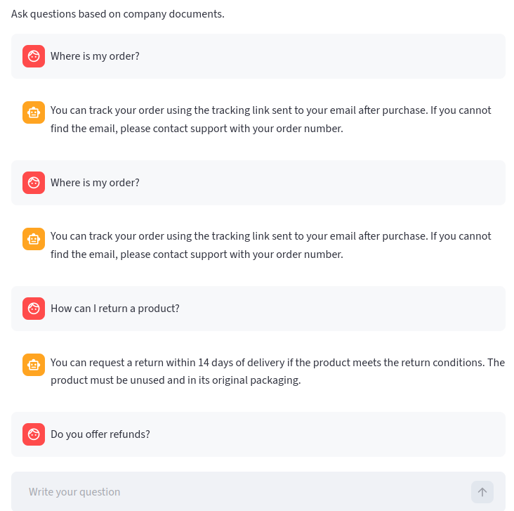

# AI Customer Support Automation System

An AI-powered system that automates customer support by answering user questions from company documents using a local RAG pipeline.

---

## Problem

Customer support teams spend significant time answering repetitive questions such as order status, returns, and refunds.

This leads to:
- High operational cost  
- Slow response times  
- Poor customer experience  

---

## Solution

This system automatically:

- Understands user queries  
- Retrieves relevant information from company documents  
- Generates accurate, context-aware responses  

All running in a **local environment**, ensuring full data privacy.

---

## Key Features

- Document-based question answering  
- Local LLM integration (LM Studio)  
- Semantic search with vector database  
- Chat interface (Streamlit)  
- Privacy-friendly (no external APIs required)  

---

## Example Use Cases

- E-commerce customer support automation  
- Internal knowledge assistants  
- FAQ automation systems  
- Document search tools  

---

## Architecture
Documents → Chunking → Embedding → Vector DB → Retrieval → LLM → Response


---

## Interface

(Add screenshot here)



---

## Tech Stack

- Python  
- LangChain  
- FAISS  
- Sentence Transformers  
- LM Studio  
- Streamlit  

---

## Run Locally

```bash
pip install -r requirements.txt
streamlit run ui/streamlit_app.py
